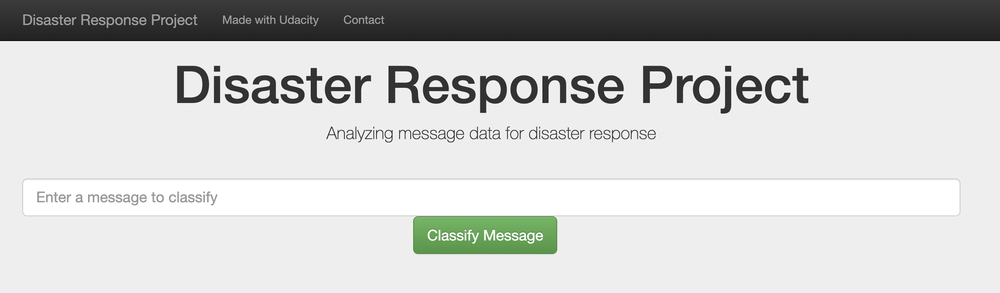
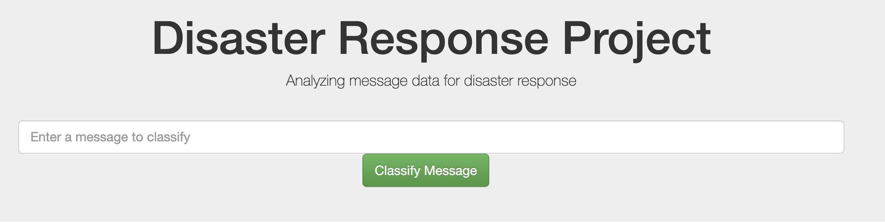
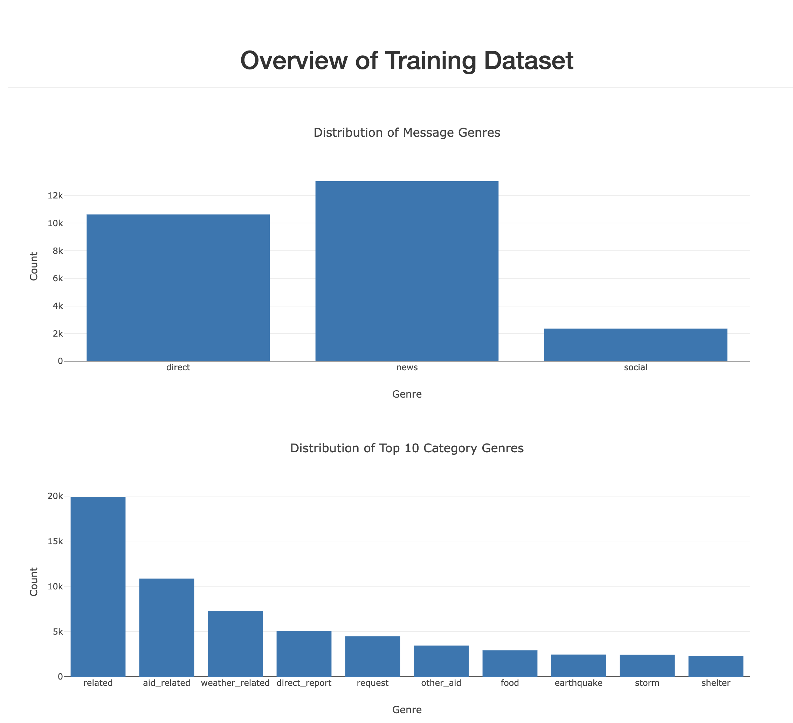
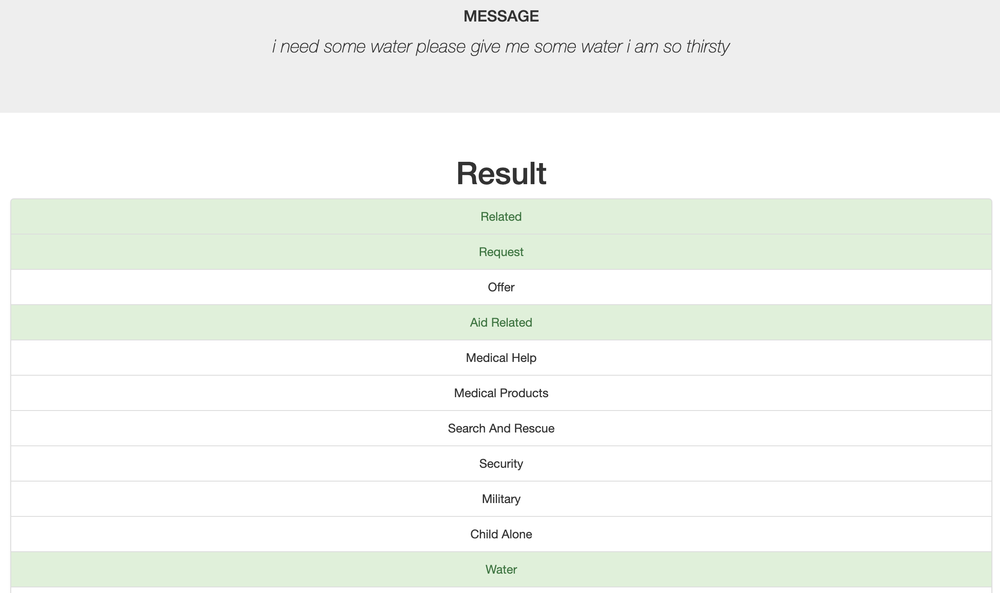

# Disaster-Response-Pipeline
Udacity Data Science Nanodegree - Disaster Response Pipeline Project

[TOC]

## Installation

### Dependencies

- Python 3.7
- Machine Learning Libraries: NumPy, SciPy, Pandas, Sciki-Learn
- Natural Language Process Libraries: NLTK
- SQLlite Database Libraqries: SQLalchemy
- Web App and Data Visualization: Flask, Plotly

## Project Summary

The Disaster Response Pipeline project is part of the Udacity Data Science Program in collaboration with Figure Eight. 

The aim of the project is to classify the message into 36 categories such as food and medical, which can help response teams reduce the response time and quickly identify the corresponding professionals.

Natural Language Processing tools are used to categorize messages.

## File Description

Folder `app` : Use `run.py` to innate the web app

Folder `data` : raw data file: `message.csv` and `categories.csv` ; ETL: `process_data.py`

Folder `models` : ML pipeline file : `train_classifier.py`

### Instructions:

1. Run the following commands in the project's root directory to set up your database and model.

   - To run ETL pipeline that cleans data and stores in database
     `python data/process_data.py data/disaster_messages.csv data/disaster_categories.csv data/DisasterResponse.db`
   - To run ML pipeline that trains classifier and saves
     `python models/train_classifier.py data/DisasterResponse.db models/classifier.pkl`

2. Go to `app` directory: `cd app`

3. Run your web app: `python run.py`

4. Go to http://0.0.0.0:3001/ Or Go to http://localhost:3001/

## Screenshots

Text box to entry new messages for classification

Overview of Train Dataset

Example

## License

